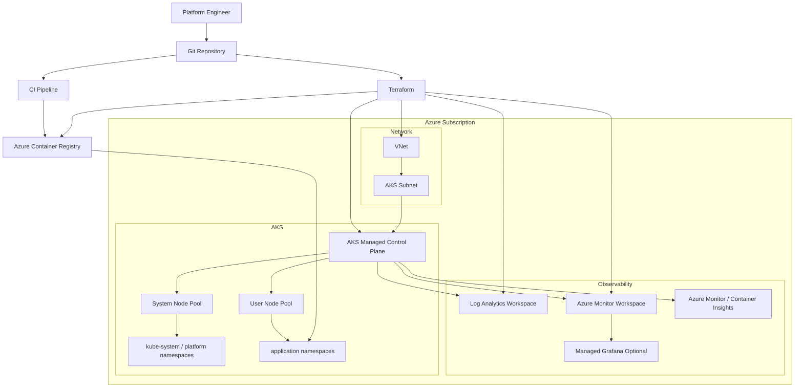

# AKS Platform Foundation

## Project overview
This repository defines a **production‑grade Azure Kubernetes Service (AKS) platform foundation**, intended to serve as a stable baseline for internal product teams.  
The focus is not on “creating a cluster,” but on **establishing a platform with clear boundaries, secure defaults, operational visibility, and documented architectural decisions**.

The platform emphasizes:
- Azure‑native integrations
- Workload isolation and failure‑domain awareness
- Observable, autoscaling infrastructure
- Employer‑grade documentation and decision records

---

## Real‑world scenario
An organization is standardizing on AKS for multiple internal product teams.  
A central platform team is responsible for delivering a **shared cluster foundation** that teams can safely onboard to without redesigning core networking, identity, or observability later.

This project represents that initial platform delivery: a **single‑region, public AKS production foundation** designed to scale operationally before scaling organizationally.

---

## Scope
In scope for this project:
- One production‑grade AKS cluster foundation in a single Azure region
- Azure CNI powered by Cilium as the networking baseline
- Dedicated system and user node pools
- Cluster autoscaler enabled on user pools
- Azure Monitor, Log Analytics, and managed Prometheus for observability
- Azure Container Registry (ACR) as the trusted image source
- OIDC issuer and Microsoft Entra Workload Identity enabled from day one
- Terraform as the Infrastructure‑as‑Code tool
- One small, representative workload used to validate the platform

---

## Non‑goals
Explicitly **out of scope** for this phase:
- Private AKS API endpoint
- Controlled egress / firewall‑centric designs
- Multi‑region or multi‑cluster failover
- Regulated‑environment hardening
- Full GitOps rollout beyond a minimal delivery model
- Large‑scale application onboarding

These are deliberate exclusions to keep the project focused and finishable while remaining production‑credible.

---

## Assumptions and constraints
**Assumptions**
- Single Azure region deployment
- Azure‑native, Azure‑first design
- Platform team owns cluster‑level resources
- Application teams operate within namespace boundaries
- Terraform manages all Azure infrastructure
- No plaintext secrets committed to the repository

**Constraints**
- Cost is bounded by limiting region count, node pool count, and alert volume
- Autoscaler limits are conservative
- Observability is production‑grade but intentionally minimal
- Architecture must remain simple enough to reason about during failure scenarios

---

## High‑level architecture
The platform separates **control plane responsibilities, workload placement, image supply, and observability paths**.

Key trust boundaries include:
- Azure‑managed control plane vs customer‑managed node pools
- System workloads vs application workloads
- Image source (ACR) vs runtime execution
- Platform administration vs application namespace access

### Architecture diagram (Mermaid)

# Milestone plan

## Milestone 1 — Design package complete
- README
- Architecture diagram
- Repository structure
- Initial ADR set drafted

## Milestone 2 — Azure foundation
- Resource groups
- VNet / subnet design
- Azure Container Registry (ACR)
- Azure Monitor prerequisites

## Milestone 3 — AKS platform baseline
- AKS with Azure CNI
- Dedicated system node pool
- Dedicated user node pool
- Autoscaler enabled
- Entra integration
- OIDC issuer and workload identity enabled

## Milestone 4 — Observability operational
- Logs and metrics flowing
- Dashboards created
- Actionable alerts configured

## Milestone 5 — Image supply and operations
- CI builds and pushes images to ACR
- Sample workload deployed and observable
- Reliability and troubleshooting drills executed
``

## Acceptance criteria summary
At project completion:
- AKS is deployed via Infrastructure as Code with Azure CNI and separate system and user node pools
- User pools scale under load via the cluster autoscaler
- Logs and metrics are visible in Azure Monitor tooling
- A sample workload builds in CI, deploys from ACR, and runs successfully
- Architectural decisions are captured in ADRs with alternatives and trade-offs
- Operational failure scenarios are documented and exercised
- Another engineer could review, deploy, and operate this platform from the repository alone

## Repository structure
aks-platform-foundation/
├─ README.md
├─ docs/
│  ├─ architecture/
│  ├─ ADR/
│  ├─ security/
│  ├─ operations/
│  └─ runbooks/
├─ infra/
│  ├─ modules/
│  └─ envs/prod-foundation/
├─ k8s/
├─ pipelines/
└─ policies/

## Decision records index
Architectural decisions are documented as ADRs:
- **001-networking-model.md** — Azure CNI powered by Cilium
- **002-node-pool-strategy.md** — System vs user node pools
- **003-autoscaling-strategy.md** — Cluster autoscaler
- **004-observability-baseline.md** — Azure Monitor + Prometheus
- **005-acr-integration.md** — Image supply via ACR
- **006-identity-model.md** — Entra ID + Workload Identity

These records capture context, decision rationale, alternatives, and consequences to support long‑term operability and design review.
``